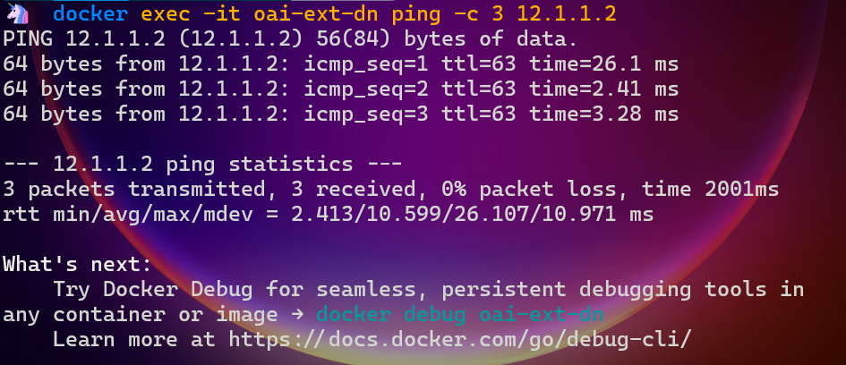
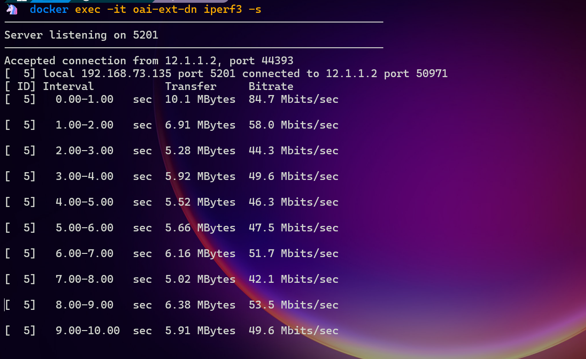
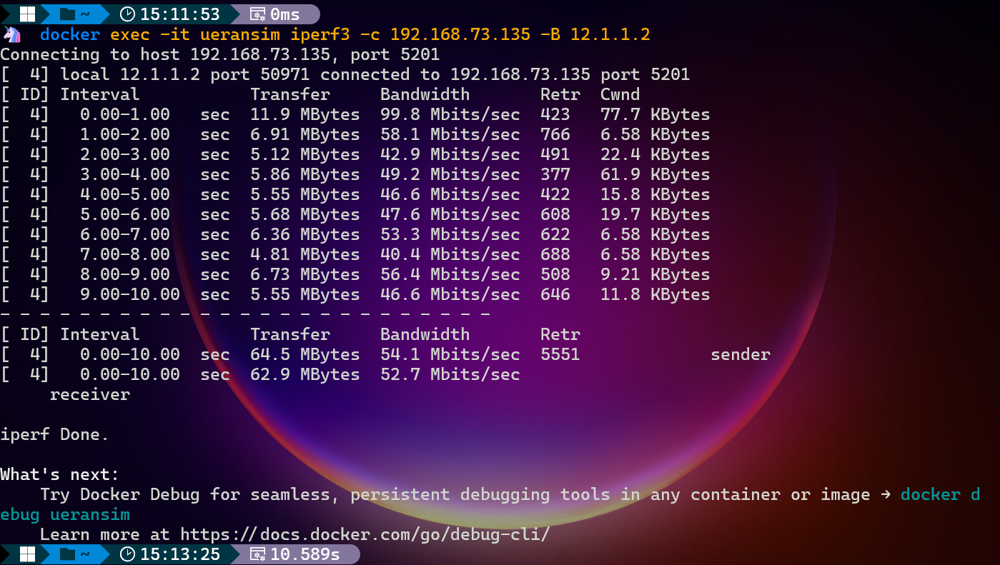

# NWDAF (Network Data Analytics Function) in 5G Core Deployment

## Mentor
Dr. Bhupendra Kumar
## Team Members
**Darsh Patel**: [202251090@iiitvadodara.ac.in](mailto:202251090@iiitvadodara.ac.in)<br>
**Soham Haldar**: [202251130@iiitvadodara.ac.in](mailto:202251130@iiitvadodara.ac.in)<br>
**Rushikesh Chaudhari**: [202251113@iiitvadodara.ac.in](mailto:202251113@iiitvadodara.ac.in)<br>
**Saksham Pathak**: [202251116@iiitvadodara.ac.in](mailto:202251116@iiitvadodara.ac.in)<br>


## Overview

This project explores the use of the **Network Data Analytics Function (NWDAF)** within a simulated 5G Core Network environment. It involves deploying and configuring key components like Open5GS and UERANSIM to simulate 5G network functionalities such as user equipment (UE) registration, data transmission, and network analytics. The implementation highlights NWDAF's role in enhancing network performance using data-driven insights.

---

## Features

- **5G Core Simulation**: Open5GS for 5G Core Network and UERANSIM for simulating User Equipment (UE) and gNB.
- **NWDAF Deployment**: Integrates NWDAF with APIs like Analytics Info, Event Subscription, and Machine Learning Model Provision.
- **Data Analytics**: Uses machine learning for anomaly detection, congestion prediction, and network optimization.
- **Containerized Environment**: Includes Docker-based setups for flexibility and scalability.
- **Network Testing**: Simulates real-world 5G scenarios to test performance and functionality.

---

## Architecture

The project uses the following components:
- **Open5GS**: Implements core network functions (AMF, SMF, UPF, etc.).
- **UERANSIM**: Simulates UE and gNB interactions with the core network.
- **NWDAF**: Provides data analytics, including anomaly detection and traffic predictions.

### System Architecture
- **Access and Mobility Management Function (AMF)**: Handles UE registration and mobility.
- **Session Management Function (SMF)**: Manages PDU sessions.
- **User Plane Function (UPF)**: Routes user data between the core and external networks.
- **NWDAF**: Analyzes network data to optimize performance.

---
## Deployment Prerequisite
Before starting, ensure you have the following installed and configured:

### Operating System:

**Preffered**: Ubuntu 20.04+ (or compatible Linux distribution).

Alternatively, use a virtualized environment like VirtualBox or WSL (Windows Subsystem for Linux).

**Docker and Docker Compose**:

Install Docker and Docker Compose for container-based setups.
```
sudo apt update
sudo apt install docker.io docker-compose
```

**Tools Installation**:

Git, Build-essential tools & iPerf3 for bandwidth testing 
```
sudo apt install git
sudo apt install build-essential
sudo apt install iperf3
```

**WireShark installation**
```
sudo add-apt-repository ppa:wireshark-dev/stable
sudo apt update
sudo apt install wireshark
wireshark --version
```

**Additional Packages**:

Python 3.x and pip 
```
sudo apt install python3 python3-pip
```
Make utility 
```
sudo apt install make
```

### Enable packet Forwarding (Important)
Enable packet forwarding on the docker-compose-host machine:
```
sudo sysctl net.ipv4.conf.all.forwarding=1
sudo iptables -P FORWARD ACCEPT
```

**Hardware Requirements**:

At least 8 GB RAM and a quad-core processor.

50 GB free disk space.

Ensure these prerequisites are met to proceed with the deployment.

## Deployment

### Virtual Machine Setup
1. **Install Open5GS**:
```
sudo apt update
sudo apt install open5gs
```
2. **Install UERANSIM**:
```
git clone https://github.com/aligungr/UERANSIM.git
cd UERANSIM
make
```
3. **Run Services**:
```
sudo systemctl start open5gs-amf
sudo systemctl start open5gs-smf
./build/nr-gnb -c config/gnb.conf
./build/nr-ue -c config/ue.conf
```
### 5G Core Deployment
**Clone Images**:
```
git clone https://gitlab.eurecom.fr/oai/cn5g/oai-cn5g-fed.git
cd oai-cn5g-fed
docker-compose -f
```
**Bridge Creation**:
```
networks:
  public_net:
      driver: bridge
      name: demo-oai-public-net
      ipam:
          config:
              - subnet: 192.168.70.128/26
      driver_opts:
          com.docker.network.bridge.name: "demo-oai"
```
**Set up routing on the gNB-host machine to reach the docker-compose-host**:
```
sudo ip route add 192.168.70.128/26 via <IP_ADDR_NIC1> dev <NIC1_NAME>
```

**Verify connectivity**:
```
ping 192.168.70.129
```
**Deploying OAI 5G Core Network**

Use the provided Python script to simplify deployment. Example commands:
```
python3 core-network.py --type start-basic
python3 core-network.py --type start-basic-vpp
python3 core-network.py --type start-mini --scenario 2
python3 core-network.py --type stop-mini --scenario 2
```
For packet capture, use the --capture option:
```
python3 core-network.py --type start-basic --capture output.pcap
```


###  OAI Docker Setup

Clone and Build Images:
```
git clone https://gitlab.eurecom.fr/oai/cn5g/oai-cn5g-fed.git
cd oai-cn5g-fed
cd docker-compose
docker-compose -f docker-compose-basic-vpp-nrf.yaml up -d
```
Deploy NWDAF:
```
docker-compose -f docker-compose-ueransim-vpp.yaml up -d
```
## Testing

### Tests Performed
1. **Ping Test**: Verify network connectivity.
```
ping <target_ip>
```
<div align="center">
    &nbsp;&nbsp;&nbsp;
</div>

2. **Service Request Test**: Validate UE session initiation.

3. **iPerf Test**: Measure network bandwidth.

iPerf Server:
```
iperf3 -s
```
<div align="center">
    &nbsp;&nbsp;&nbsp;
</div>

iPerf Client:
```
iperf3 -c <server_ip>
```
<div align="center">
    &nbsp;&nbsp;&nbsp;
</div>

## NWDAF Features
**Data Collection**: Gathers network data from AMF, SMF, etc.

**Data Analysis**: Uses ML models for traffic prediction and anomaly detection.

**Insights Delivery**: Provides actionable insights via APIs.
## Results and Outcomes
Successfully deployed NWDAF within a simulated 5G Core Network.
Demonstrated data-driven insights for optimizing network operations.
Validated ML-based anomaly detection under real-world 5G scenarios.
## Acknowledgments

We would like to express our gratitude to the following individuals and organizations for their invaluable support and guidance throughout this project:

- **Dr. Bhupendra Kumar** our mentor for this design project, for their expert advice and encouragement.
- **IIIT Vadodara** for providing the resources and infrastructure required for this research.
- **Open5GS and UERANSIM Communities** for their comprehensive documentation and active support forums.
- **3GPP Standards** for offering detailed specifications and references for NWDAF and related 5G Core functionalities.
- **Open Source Contributors** of Docker, OpenAirInterface, and other tools used in this project.
  

This project would not have been possible without their contributions and support.

## Contact
For any questions and feedback, please feel free to reach out to us at [202251130@iiitvadodara.ac.in](mailto:202251130@iiitvadodara.ac.in)  
## License
This project is licensed under the MIT License - see the LICENSE file for details.


